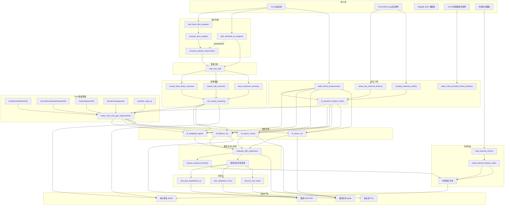

# CRC 总生存期风险预测流水线 — 细节剖析

## 1. 端点构建模块

### 1.1 固定时间窗端点构建 (`add_fixed_36m_endpoint`)

**算法原理**：以 τ 个月（如 36 个月）为观察窗口，将每位患者归为以下三类之一：

| 类别 | 条件 | `death_by_36m_observed` | `death_by_36m` | `early_censored_before_36m` |
|------|------|------------------------|----------------|---------------------------|
| τ 内死亡 | `event==1 AND time_months <= τ` | `True` | `1.0` | `False` |
| τ 内存活 | `time_months > τ` | `True` | `0.0` | `False` |
| τ 前删失 | `event==0 AND time_months <= τ` | `False` | `NaN` | `True` |

**关键设计决策**：早期删失（τ 前删失）的标签设为 `NaN` 而非强制标记为存活。这避免了将信息不完整的患者错误地当作阴性标签，后续 IPCW 和伪观测方法会专门处理这些案例。

**内部状态**：函数无状态，纯函数式转换。输入 DataFrame 被复制后修改，不影响原始数据。

**依赖关系**：调用 `detect_event_time_columns()` 自动识别时间/事件列名，支持 `OS_TIME_MONTHS`、`OS_MONTHS`、`time_months` 等多种命名惯例；`coerce_event()` 将 `deceased/living`、`1:deceased/0:living`、布尔值等统一映射为 0/1。

### 1.2 Kaplan-Meier 生存函数估计 (`kaplan_meier_survival_at`)

**算法原理**：手动实现乘积极限估计量（Product-Limit Estimator）：

$$\hat{S}(t) = \prod_{t_i \leq t} \left(1 - \frac{d_i}{n_i}\right)$$

其中 $d_i$ 为时间 $t_i$ 处的事件数，$n_i$ 为该时刻的风险集大小。

**实现细节**：
1. 按时间排序，提取唯一事件时间点
2. 逐时间点递推计算生存概率
3. 使用 `np.searchsorted` 对查询时间点进行右对齐查找，实现批量查询
4. 输出值裁剪到 `[EPS, 1.0]` 区间，避免零权重

**应用场景**：被 `compute_ipcw_weights` 和 `compute_pseudo_observations` 调用，是整个删失处理体系的基础。

### 1.3 IPCW 权重计算 (`compute_ipcw_weights`)

**算法原理**：逆删失概率加权（Inverse Probability of Censoring Weighting）。对每位在 τ 内有可观测标签的患者，其权重为：

$$w_i = \frac{1}{\hat{G}(\min(T_i, \tau))}$$

其中 $\hat{G}(t)$ 是以**删失**为事件拟合的 Kaplan-Meier 生存函数（即删失概率的补函数）。

**实现细节**：
- 删失事件定义为 `event == 0`
- 评估时间为 `min(time_months, tau)`
- 仅 `death_by_36m_observed == True` 的患者获得非零权重
- 权重分母通过 `np.clip(g_at_eval, EPS, None)` 防止极端权重

**防泄漏设计**：IPCW 权重仅在训练集上估计；评估时使用训练集的删失分布。

### 1.4 伪观测值计算 (`compute_pseudo_observations`)

**算法原理**：基于留一法（Jackknife）的伪观测值，用于将生存结局转化为个体级别的连续变量：

$$\theta_i = n \cdot \hat{F}(\tau) - (n-1) \cdot \hat{F}_{-i}(\tau)$$

其中 $\hat{F}(\tau) = 1 - \hat{S}(\tau)$ 是全样本的 KM 累积发生率，$\hat{F}_{-i}(\tau)$ 是去掉第 $i$ 个样本后的估计。

**实现细节**：
- 对 n ≤ 1200 的队列执行精确留一法（n 次 KM 拟合）
- 对 n > 1200 的大队列使用近似：所有伪观测值设为 $\hat{F}(\tau)$
- 输出 `pseudo_risk_36m` 裁剪到 `[0, 1]` 后存为 `pseudo_risk_36m_clipped`

**应用场景**：伪观测值作为因果筛选模块的结局变量，以及 IPCW Logistic 回归的辅助标签。

---

## 2. 临床预处理模块

### 2.1 列选择 (`select_clinical_columns`)

**硬编码列名清单**：
- 数值候选：`AGE`、`WEIGHT`、`DAYS_LAST_FOLLOWUP`
- 分类候选：`SEX`、`AJCC_PATHOLOGIC_TUMOR_STAGE`、`PATH_T_STAGE`、`PATH_N_STAGE`、`PATH_M_STAGE`、`SUBTYPE`、`CANCER_TYPE_ACRONYM`、`RACE`、`GENETIC_ANCESTRY_LABEL`

仅保留实际存在于 DataFrame 中的列。

### 2.2 预处理流水线 (`build_clinical_preprocessor`)

**架构**：`ColumnTransformer` 包裹两条子管道：
- 数值管道：`SimpleImputer(strategy="median")` → `StandardScaler()`
- 分类管道：`SimpleImputer(strategy="most_frequent")` → `OneHotEncoder(handle_unknown="ignore", sparse_output=False)`

外层追加 `DenseFrameTransformer` 确保输出为 numpy 稠密数组。

**设计模式**：`ColumnTransformer` 的 `remainder="drop"` 策略丢弃未选列，保证输出维度可控。`handle_unknown="ignore"` 使外部验证时未知分类水平被安全编码为全零向量。

### 2.3 外部兼容变换 (`transform_clinical_frame`)

当外部队列缺少某些临床列时，自动填充 `NaN` 并通过流水线处理。数值列强制 `pd.to_numeric(errors="coerce")`，避免字符串类型错误。返回 `(transformed_df, missing_columns_list)` 供兼容性审计。

---

## 3. 多组学特征工程模块

### 3.1 表达矩阵处理 (`matrix_patients_to_rows`)

**数据流**：TSV 文件（基因×患者布局）→ 转置为患者×基因矩阵。具体步骤：
1. 自动检测 ID 列（`Hugo_Symbol` / `gene` / `feature`）
2. 去重、设为索引
3. 数值化（`pd.to_numeric(errors="coerce")`）后转置
4. 患者 ID 归一化（`normalize_patient_id`）
5. 重复 ID 取均值聚合

### 3.2 特征选择策略

| 函数 | 适用数据类型 | 选择标准 | 参数 |
|------|------------|---------|------|
| `select_top_variance_features` | 连续型（表达/通路） | 训练集方差降序 Top-N | `max_features`（默认 300）|
| `select_train_prevalent_binary_features` | 二值型（突变） | 训练集流行度 ∈ [min_prevalence, max_prevalence] | `min_prevalence=0.02`, `max_prevalence=0.80` |

**防泄漏**：特征选择仅在训练集上计算统计量（方差/流行度），再应用于全部样本。

### 3.3 通路活性评分 (`compute_pathway_activity`)

**算法**：简单的基因集均值法。对每个 MSigDB GMT 中的基因集：
1. 找出基因集与表达矩阵交集基因（要求 5 ≤ |交集| ≤ 500）
2. 该通路的活性评分 = 交集基因表达值的行均值
3. 最多保留 100 个通路

**依赖**：`find_msigdb_gmt()` 在 `rawData/MSigDB/` 下查找最大的 `.gmt` 文件。

### 3.4 特征标准化 (`fit_transform_feature_matrix`)

仅在训练集上拟合 `SimpleImputer(strategy="median")` + `StandardScaler()`，然后变换全部样本。返回标准化后的 DataFrame 和拟合的 Pipeline（用于外部队列）。

---

## 4. 因果筛选模块

### 4.1 AIPW 因果效应估计 (`causal_aipw_binary_exposure`)

**算法原理**：增强逆概率加权（Augmented Inverse Probability Weighting）是双重稳健估计器：

$$\hat{\tau}_{AIPW} = \hat{\mu}_1 - \hat{\mu}_0 + \frac{A(Y - \hat{\mu}_1)}{\hat{e}} - \frac{(1-A)(Y - \hat{\mu}_0)}{1 - \hat{e}}$$

**实现细节**：
- **倾向性模型**：`LogisticRegression(max_iter=2000, solver="lbfgs")`
- **结局模型**：两个 `RandomForestRegressor(n_estimators=60, min_samples_leaf=8)`，分别在 A=0 和 A=1 子集上训练
- **交叉拟合**：使用 `StratifiedKFold` 进行 K 折交叉预测（K = min(5, 最小类计数)），避免过拟合
- **倾向性裁剪**：$\hat{e}$ 裁剪到 `[0.02, 0.98]`，防止极端权重
- **输出**：ATE（平均处理效应）、ATE 标准误、双侧正态 p 值

**暴露变量构造**：将连续特征按中位数二值化（`exposure > median` → A=1）。

**协变量调整**：使用临床特征矩阵作为混杂因素 W。

### 4.2 CATE 异质性分析 (`causal_cate_summary`)

使用两个独立的 RandomForest 分别拟合 A=0 和 A=1 条件下的结局，CATE = $\hat{Y}_1(W) - \hat{Y}_0(W)$。输出 CATE 的标准差和 IQR，衡量处理效应的异质性程度。

### 4.3 剂量-响应分析 (`dose_response_summary`)

将连续暴露变量分为 5 个分位数箱，计算每箱的暴露均值和结局均值，然后：
- **线性斜率**：`stats.linregress` 拟合
- **单调性**：`stats.spearmanr` 相关系数

### 4.4 综合排名 (`run_causal_screening`)

因果优先级分数计算公式：

$$\text{score} = -\text{rank}(|ATE|) - 0.5 \times \text{rank}(p) - 0.25 \times \text{rank}(|\text{dose\_slope}|)$$

分数越高表示因果优先级越高。

---

## 5. GAN 数据增强模块

### 5.1 WGAN-GP 条件表格生成器 (`ConditionalTabularGAN`)

**架构**：
- **生成器**：`Linear(latent_dim+1, h)` → `LayerNorm` → `ReLU` → `Dropout` → `Linear(h, h)` → `LayerNorm` → `ReLU` → `Linear(h, output_dim)`
- **判别器（Critic）**：`Linear(input_dim, h)` → `LayerNorm` → `LeakyReLU(0.2)` → `Dropout` → `Linear(h, h)` → `LayerNorm` → `LeakyReLU(0.2)` → `Linear(h, 1)`（无 Sigmoid）

**关键设计选择**：
- 使用 `LayerNorm` 而非 `BatchNorm`：对条件无关、训练/推理行为一致、在小批量（n~150）时稳定
- WGAN-GP 梯度惩罚：$\lambda_{gp} \cdot \mathbb{E}[(\|\nabla_{\hat{x}} D(\hat{x})\|_2 - 1)^2]$，其中 $\hat{x} = \alpha x_{real} + (1-\alpha) x_{fake}$
- Critic 每轮更新 `n_critic=5` 次，Generator 每轮更新 1 次
- Adam 优化器：`betas=(0.0, 0.9)`、`weight_decay=1e-5`
- 数据预处理：`QuantileTransformer(output_distribution="normal")` 将特征映射到正态分布

**质量驱动早停**：不使用判别器损失，而是监控 `_monitor_qc_score`（真实与生成数据的标准化均值差 + Wasserstein 距离 + 条件差距），保留最优生成器权重。`patience=30` 轮无改善则停止。

### 5.2 生存感知 WGAN-GP (`SurvivalConditionalTabularGAN`)

继承自 `ConditionalTabularGAN`，主要区别：
- 条件维度从标量（`death_by_36m`）扩展为 5 维生存条件向量：`[death_by_36m, event, log1p_time_months, pseudo_risk_36m_clipped, ipcw_weight_36m]`
- 生成器输入维度 = `latent_dim + 5`
- 判别器输入维度 = `output_dim + 5`
- 训练时保存生成器和判别器的联合最优状态

### 5.3 特征空间 GAN (`FeatureSpaceGAN`)

**两阶段架构**：
1. **自编码器**：`Linear(d, 128)` → `BN` → `ReLU` → `Linear(128, 64)` → `BN` → `ReLU` → `Linear(64, k)` → 解码器对称结构。隐空间维度 k = min(latent_k, d//2, n//3)。可选 `risk_aware` 模式：在隐变量上附加风险预测头（BCEWithLogitsLoss + IPCW 权重），系数 0.2。
2. **隐空间 GAN**：在自编码器编码后的 k 维隐空间中训练 `SurvivalConditionalTabularGAN`（`skip_scaler=True`，避免双重变换）。

**生成流程**：隐空间 GAN 采样 → 解码器反变换 → QuantileTransformer 逆变换 → 原始特征空间。

### 5.4 SMOTE 插值增强 (`SmoteLikeAugmenter`)

**算法**：无依赖的 SMOTE 风格插值：
1. 按类别（事件/非事件）分组，构建每类的 `NearestNeighbors`
2. 对每个合成样本：随机选一个真实样本 → 找其 k 近邻 → 随机选一个近邻 → 线性插值 `base + λ * (neighbor - base)`，λ ~ U(0,1)
3. 可选高斯抖动（`jitter` 参数）

**适用场景**：在 n ≤ ~200 的小样本临床队列中，对抗生成器容易过拟合/模式崩溃，SMOTE 插值能保持数据流形结构。

### 5.5 合成数据质量控制 (`synthetic_data_qc`)

**五维评估体系**：

| 维度 | 指标 | 通过标准 | 说明 |
|------|------|---------|------|
| KS 检验 | 逐列 KS 统计量 D 的均值 | `ks_stat_mean ≤ max(2*ks_ref, 0.15)` | 基于自参照基线（真实数据二等分测量噪声地板） |
| Wasserstein 距离 | 标准化后逐列 WD 均值 | `wd_mean ≤ max(2*wd_ref, 0.12)` | 同上 |
| PCA 方差结构 | 真实/合成 PCA explained_variance_ratio 的相关系数 | `pca_var_corr > 0.70` | 检测全局方差结构保持度 |
| DCR 比率 | 合成→真实最近邻距离 / 真实→真实第二近邻距离 | `0.5 ≤ dcr_ratio ≤ 3.0` | 检测隐私泄露（过近）或模式崩溃（过远） |
| MIA 风险 | 成员推理攻击准确率 | `mia_acc < 0.65` | 需要 holdout 数据；使用 NN 距离的中位数阈值分类 |

**自参照基线**：将真实数据随机二等分，测量 KS/Wasserstein 的"采样噪声地板"，阈值设为 `max(2*baseline, fixed_threshold)`。这避免了固定阈值在小样本时过于严格的问题。

**综合判定**：5 维中通过 ≥ `min_good`（默认 4）维则通过。

### 5.6 增强策略与比例自动选择 (`select_train_only_gan_augmentation`)

**搜索空间**：4 种采样策略 × 4 种比例候选 = 最多 16 种组合。

**选择流程**：
1. 在真实训练数据上计算基线 CV 指标（`train_only_cv_metrics_for_real_logistic`）
2. 对每种组合执行 GAN 拟合 → QC → 生成 → CV 评估
3. 效用门槛：`QC passed AND AUC gain ≥ 0.005 AND AP delta ≥ 0 AND Brier delta ≤ 0`
4. 在通过门槛的候选中，按以下优先级排序：最小比例 → 更高 AUC gain → 更高 AP delta → 更低 Brier → 更高 QC good_count

**CV 评估机制**（`train_only_cv_metrics_for_augmented_logistic`）：在训练集上进行 K 折交叉验证，每折仅在该折训练部分拟合 GAN，在折验证部分评估 IPCW Logistic 回归。

### 5.7 矩匹配校准 (`_moment_match_calibrate`)

在 QC 之前对合成数据进行逐列、逐类别的矩匹配：

$$x'_{syn} = (x_{syn} - \mu_{syn}) \cdot \frac{\sigma_{real}}{\sigma_{syn}} + \mu_{real}$$

分别对事件类和非事件类独立校准，确保 QC 评估的正是下游模型实际训练的数据。

---

## 6. 生存模型训练模块

### 6.1 IPCW 加权 Logistic 回归 (`fit_weighted_logistic`)

**模型**：`LogisticRegressionCV`，elasticnet 正则化，SAGA 求解器。
- 交叉验证折数：`min(5, max(2, 最小类计数))`
- L1 比例候选：`[0.05, 0.5, 0.95]`
- 正则化强度候选：10 个 C 值
- 评分标准：`roc_auc`
- 样本权重：IPCW 权重（`ipcw_weight_36m`）

**标签来源**：仅使用 `ipcw_label_available == True` 的样本（即 `death_by_36m_observed` 为真的患者）。

### 6.2 Cox 比例风险模型 (`fit_lifelines_cox`)

**模型**：`CoxPHFitter(penalizer=0.1)`（lifelines 库）。
- 将特征矩阵与 `time_months`、`event` 列合并后拟合
- 自动丢弃全 NaN 列
- 要求事件数 ≥ 5

**预测方式**（`predict_lifelines_risk`）：
- 首选：`predict_survival_function(X, times=[tau])` → 风险 = 1 - S(τ)
- 回退：`predict_partial_hazard(X)` → 连续风险排名

### 6.3 Coxnet (`fit_sksurv_coxnet`)

**模型**：`CoxnetSurvivalAnalysis(l1_ratio=0.9, alpha_min_ratio=0.01, n_alphas=60)`（scikit-survival 库）。
- 弹性网正则化，L1 比例 0.9（偏向稀疏解）
- 自动搜索 60 个 alpha 值
- 最大迭代 100000 次
- 要求特征数 ≤ 2000

**预测方式**（`predict_sksurv_risk`）：
- 首选：`predict_survival_function(X)` → 对每个样本返回步进函数 → 1 - fn(τ)
- 回退：`predict(X)` → 风险排名

### 6.4 随机生存森林 (`fit_sksurv_rsf`)

**模型**：`RandomSurvivalForest(n_estimators=300, min_samples_split=10, min_samples_leaf=8, max_features="sqrt", n_jobs=-1)`。
- 对高维特征友好（sqrt 特征采样）
- 使用 log-rank 分裂标准
- 支持预测生存函数

**预测方式**：同 Coxnet 的 `predict_sksurv_risk`。

### 6.5 模型特征集配置

| 特征集名称 | 组成 | 典型维度 |
|-----------|------|---------|
| `clinical_only` | 临床预处理后的数值+独热编码列 | ~15-25 |
| `clinical_expression_topvar` | 临床 + Top 方差表达基因 | ~315-325 |
| `clinical_causal_priority` | 临床 + 因果筛选 Top 表达基因 | ~65-75 |
| `clinical_pathway` | 临床 + 通路活性评分 | ~115-125 |
| `clinical_somatic_mutation` | 临床 + 体细胞突变二值特征 | ~55-105 |

---

## 7. 模型评估模块

### 7.1 固定时间窗评估 (`evaluate_36m_predictions`)

**指标体系**：

| 指标 | 计算方法 | 说明 |
|------|---------|------|
| `auc_36m_observed` | IPCW 加权 `roc_auc_score` | 仅对 `death_by_36m_observed` 样本 |
| `brier_36m_ipcw` | IPCW 加权均方误差 | $\sum w_i (y_i - \hat{p}_i)^2 / \sum w_i$ |
| `average_precision_36m` | IPCW 加权 `average_precision_score` | 对不平衡数据的敏感指标 |
| `harrell_cindex` | 手动 O(n²) 对遍历 | 对所有有有效风险分数的样本 |
| `uno_cindex_ipcw` | scikit-survival `concordance_index_ipcw` | IPCW 修正的一致性指数 |
| `time_dependent_auc_36m` | scikit-survival `cumulative_dynamic_auc` | 时间依赖 AUC |

**阈值选择**（`choose_training_threshold`）：在训练集 ROC 曲线上找 Youden 指数最大点（`argmax(TPR - FPR)`），用于二分类指标（混淆矩阵）。

### 7.2 Harrell C-index 回退实现 (`uno_cindex_fallback`)

O(n²) 遍历所有样本对 (i, j)：
- 许可对：`t_i < t_j` 且 `e_i == 1`
- 一致对：`r_i > r_j`（或 `r_i == r_j` 时 +0.5）
- C-index = 一致对 / 许可对

---

## 8. 可视化模块

### 8.1 时间依赖 ROC (`plot_time_dependent_roc`)

使用 `roc_curve` + `roc_auc_score`（带 IPCW 样本权重），在 τ 时间点绘制 ROC 曲线，标注 AUC 值。

### 8.2 校准曲线 (`plot_calibration_curve`)

将预测风险分为 n_bins 个分位数箱，每箱计算 IPCW 加权预测均值和观测均值，绘制点图 + 45° 参考线。点大小与样本量成正比。

### 8.3 Kaplan-Meier 风险分层 (`plot_km_risk_strata`)

按风险分数中位数（或指定阈值）分为高/低风险组，分别拟合 K-M 生存曲线，附 95% 置信区间。使用 log-rank 检验比较两组差异。在 τ 处绘制垂直参考线。

**输出格式**：每张图同时保存 PNG（300 dpi）和 TIFF（600 dpi），使用 `bbox_inches="tight"`。

---

## 9. 外部验证模块

### 9.1 外部队列加载 (`load_external_cohorts`)

扫描 `rawData/preprocessed/` 下所有 `*_os_clinical_endpoint_qc.tsv` 文件（排除 `tcga_` 前缀），对每个文件执行：端点构建 → IPCW 权重 → 伪观测值。

### 9.2 外部特征矩阵构建 (`build_external_feature_matrix`)

**分层兼容机制**：

| 数据层 | 匹配方式 | 缺失处理 |
|--------|---------|---------|
| 临床 | 训练集预处理器直接变换 | 缺失列填 NaN，标记 `imputed_missing:N` |
| 表达 | 按队列名前缀匹配预定义路径（cptac/geo/htan） | 标记 `not_available` 或 `no_overlap` |
| 通路 | 基于外部表达矩阵重新计算 | 标记 `no_pathway_overlap` |
| 突变 | 按队列名前缀匹配（cptac/htan/msk） | 标记 `not_available` |

返回的 `compatibility` 字典记录每层的兼容状态，供审计使用。

**跳过条件**：当主模型所需特征在外部队列中缺失（且非纯临床模型）时，跳过该队列的主模型验证，但仍记录候选模型诊断。

---

## 10. UnlimitedOS 扩展专题

### 10.1 importlib 动态加载 (`load_three_years_base`)

```python
base_path = Path(__file__).resolve().with_name("3YearsOS.py")
spec = importlib.util.spec_from_file_location("three_years_os_base", base_path)
module = importlib.util.module_from_spec(spec)
sys.modules[spec.name] = module
spec.loader.exec_module(module)
```

**设计理由**：避免代码复制，直接复用 3YearsOS 的全部工具函数。`sys.modules` 注册确保后续 `base.xxx` 访问正常工作。加载后通过 `base = load_three_years_base()` 获得模块引用。

### 10.2 全随访端点适配 (`add_unlimited_os_endpoint`)

与固定时间窗不同，UnlimitedOS 保留完整的 `time_months` / `event` 对：
- `os_event` = 原始事件状态（0/1）
- `os_censored` = `event == 0`
- `log1p_time_months` = `ln(1 + max(0, time_months))`
- `os_case_weight` = 1.0（所有样本等权）

### 10.3 风险代理分数 (`make_os_event_risk_proxy`)

$$\text{score} = \text{event} \times (1 - 0.5 \times \text{time\_rank}) + (1 - \text{event}) \times 0.25 \times (1 - \text{time\_rank})$$

其中 `time_rank` 是 `time_months` 的百分位排名（0~1）。该分数综合了事件状态和随访时间信息：
- 早期死亡（time_rank 低）→ 高分（接近 1.0）
- 晚期死亡（time_rank 高）→ 中等分（接近 0.5）
- 删失（event=0）→ 低分，随时间增长而增加

**应用场景**：替代固定时间窗的 `pseudo_risk_36m_clipped`，作为因果筛选的结局变量和 GAN 条件。

### 10.4 GAN 端点适配

UnlimitedOS 提供 `adapt_endpoint_for_train_only_augmentation` 和 `restore_endpoint_after_train_only_augmentation` 两个函数，将全随访端点映射为 3YearsOS 的 GAN 条件列布局，调用 `base.select_train_only_gan_augmentation()`，再恢复为 Unlimited 端点格式。

### 10.5 评估指标差异

| 指标 | 3YearsOS（固定时间窗） | UnlimitedOS（全随访） |
|------|----------------------|---------------------|
| 一致性指数 | Harrell C + Uno IPCW C（τ 处） | Harrell C + Uno IPCW C（无 τ 限制） |
| AUC | 固定时间窗 AUC（`cumulative_dynamic_auc` at τ） | 不计算 |
| Brier 分数 | IPCW 加权二分类 Brier | Integrated Brier Score（多时间点积分） |
| 事件 Brier | 不计算 | `brier_score_loss(event, rank_scaled_risk)` |
| 风险阈值 | ROC Youden 最优 | 训练集中位数 |

**Integrated Brier Score**：在训练集和评估集时间范围的 15%~85% 分位数间选取 8 个评估时间点，预测生存函数矩阵 S(t|x)，调用 `sksurv.metrics.integrated_brier_score` 计算时间积分。

---

## 11. 系统架构图


